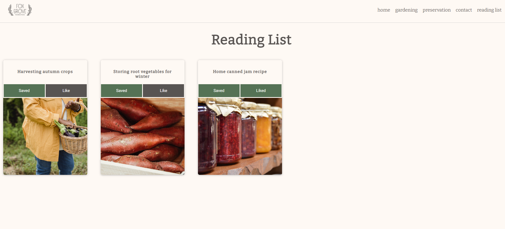

# Fox Grove Homestead - Fake blog site

This project was created as a final capstone project for the HyperionDev Web Development Bootcamp. This is a fully responsive site that allows users to like and save articles for later.

## Table of Contents

- Getting Started
- Usage

## Getting Started / Installation

1. Clone the respository

  ```bash
    git clone https://github.com/kelleyfraser/finalCapstone.git
    cd finalCapstone
  ```


2. Use live server to open index.html

## Usage

You can save or like articles on this fake blog by clicking on the Save or Like buttons either on the article card found under the corresponding category pages or on each individual article page. 

The saved articles will appear in your reading list that can be navigated to using the link on the navigation bar menu. 

</img>

